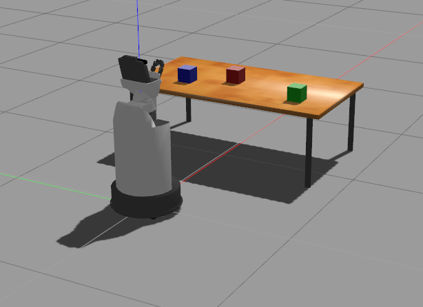
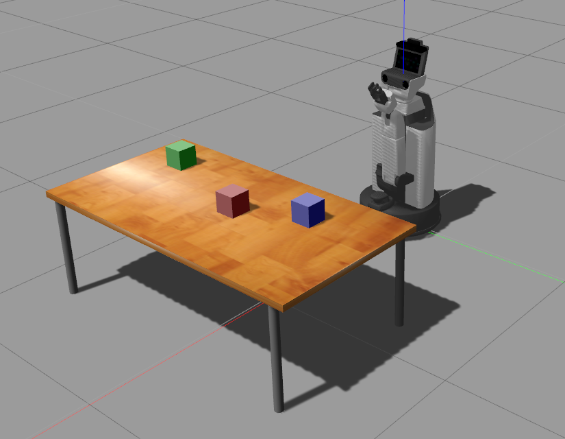
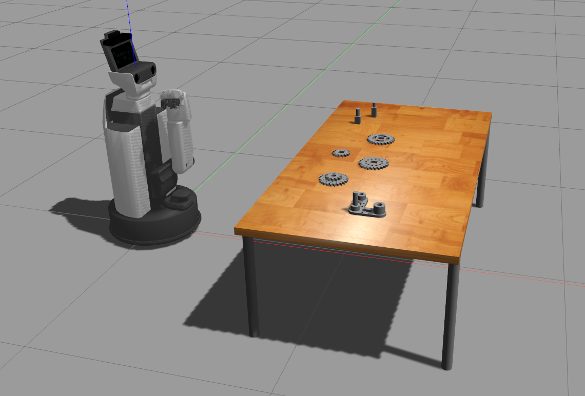
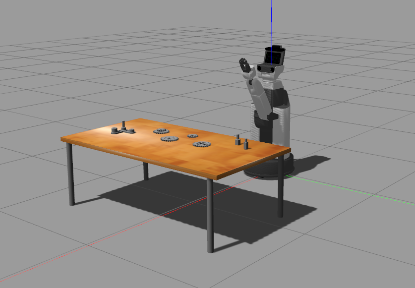

# An OpenAI gym environment based on Gazebo and ROS for Human Support Robot (HSR)

Work in progress

Instructions:
- Add `gym-gazebo-hsr` to PYTHONPATH
- Add  `.../models` to GAZEBO_MODEL_PATH
- In /opt/ros/kinetic/python2.7/dist-packages/hsrb_interface/end_effector.py
    * In method `command`
    add
    ```python
    self._follow_joint_trajectory_client.action_client.wait_for_server()
    ```
    before
    ```python
    self._follow_joint_trajectory_client.send_goal(goal)
    ```

    * In method `apply_force`
    add
    ```python
    client.action_client.wait_for_server()
    ```
    before
    ```python
    client.send_goal(goal)
    ```

How to run:
(replace ```git/``` by your repository)
- run ```python git/gym-gazebo-hsr/examples/gazebo_hsr_assembly_v0.py  --world='three_cubes'```
   <p float="left">
     
      
   </p>
- run ```python git/gym-gazebo-hsr/examples/gazebo_hsr_assembly_v0.py  --world='assembly'```
   <p float="left">
     
      
   </p>

